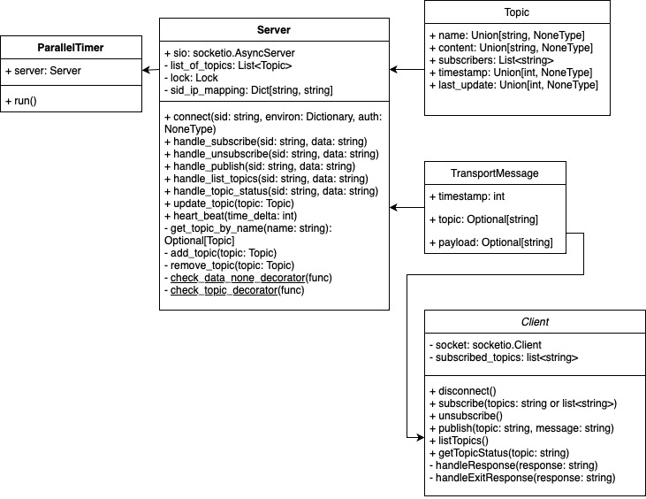

# Testat Verteilte Systeme: Publisher/Subscriber System
- [Codedokumentation](#codedokumentation)
- [Technologien (und deren Funktionalität)](#technologien-und-deren-funktionalität)
  - [Asyncio](#asyncio)
  - [Socketio](#socketio)
  - [Pytest](#pytest)
  - [Argparse](#argparse)
- [Architekturbeschreibung](#architekturbeschreibung)
- [Schnittstelle Server/Client](#schnittstelle-serverclient)
- [Fehlerbehandlung](#fehlerbehandlung)
- [Nebenläufigkeitstransparenz](#nebenläufigkeitstransparenz)
- [Buildprozess Client/Server](#buildprozess-clientserver)
- [Verwendung Client/Server](#verwendung-clientserver)
  - [Einschränkungen](#einschränkungen)
- [Testumfang und -ergebnis](#testumfang-und--ergebnis)

Bearbeitende: Miriam Astor, David Felder, Steffen Freitag, Florian Glaser, Florian Herkommer

## Codedokumentation
Die Dokumentation des Codes ist unter folgender URL einzusehen: [https://dhbw-fn-tit20.github.io/verteilte-systeme-ffdms/](https://dhbw-fn-tit20.github.io/verteilte-systeme-ffdms/)

## Technologien (und deren Funktionalität)

### Asyncio
[Asyncio](https://docs.python.org/3/library/asyncio.html) ist die Grundlage für verschiedene asynchrone Python Frameworks. Es ermöglicht die gleichzeitige Ausführung von Code und den Syntax mit async und await. Dabei wird [AIOHTTP](https://docs.aiohttp.org/en/stable/) verwendet, um eine Asynchronous Server Gateway Interface Anwendung (ASGI) zu erstellen.

### Socketio
[Socket.IO](https://socket.io/) ist ein Transportprotokoll. Es ermöglicht eine bidirektionale, ereignisgesteuerte Kommunikation zwischen Clients und einem Server in Echtzeit.

### Pytest
[Pytest](https://docs.pytest.org/en/7.3.x/index.html) ist ein Framework zum Testen von Python Code.

### Argparse
[Argparse](https://docs.python.org/3/library/argparse.html) wird eingesetzt, um Parameter aus der Kommandozeile zu behandeln. Dabei werden sowohl erforderliche als auch optionale Parameter unterstützt.

## Architekturbeschreibung


Die Funktionen des Clients und Servers sind jeweils mit den Objekten Client und Server realisiert.

Das Objekt TransportMessage dient zur Strukturierung der Kommunikation zwischen Client und Server.
Die Klasse Topic bildet alle Informationen ab, die zu einem Topic gespeichert werden sollen.
Der ParallelTimer startet einen neuen Thread, der den Heart-Beat-Mechanismus realisiert.

## Schnittstelle Server/Client
Bei der Kommunikation zwischen Server und Client wird die zu JSON konvertierte Klasse _TransportMessage_ übertragen. Diese enthält als Parameter den Namen des Topics, den Payload sowie einen Timestamp.

Als Protokoll wird HTTP mit einer TCP Verbindung verwendet. Der Port ist standardmäßig auf `8080` gesetzt.

## Fehlerbehandlung
Tritt ein entsprechender Fehler auf, wird eine aussagekräftige Fehlermeldung an den Client übertragen und anschließend ausgegeben.

## Nebenläufigkeitstransparenz
Um simultanen Zugriff auf die Topic-Liste zu verhindern, wird das Python Objekt [Lock](https://docs.python.org/3/library/threading.html#lock-objects) verwendet. Dies kann bestimmte kritische Codeabschnitte threadübergreifend blocken und nur einem Thread Zugriff auf diesen Abschnitt gewähren. Mithilfe dieses Mechanismus wird das Hinzufügen und Entfernen von Topics abgesichert.

## Buildprozess Client/Server
Python `3.9.16` wird unterstützt.<br/>
Installation der Requirements:

```bash
pip install -r requirements.txt
```

## Verwendung Client/Server
Mit `python src/client.py --help` und `python src/server.py --help` kann die Programmhilfe zum Client und Server angezeigt und Informationen zu allen Aktionen entnommen werden.

### Einschränkungen
Es existieren keinerlei Einschränkungen hinsichtlich Topic- bzw. Nachrichtenlänge. Auch ist die maximale Anzahl an Topics sowie die der Subscriber pro Topic nicht limitiert. Ebenfalls kann jeder Zeichensatz verwendet werden.

**Einfaches Beispiel:**

Server starten:

```bash
python src/server.py

>>> ======== Running on http://127.0.0.1:8080 ========
>>> (Press CTRL+C to quit)
```

Einem Topic subscriben:

  ```bash
  python src/client.py --server http://127.0.0.1:8080 --subscribe first_topic second_topic
  ```

Eine Nachricht an ein Topic senden:

  ```bash
  python src/client.py --server http://127.0.0.1:8080 --publish second_topic --message "Hello World Message"
  ```

## Testumfang und -ergebnis

Die Tests umfassen Server, Client und User Client Testfälle. Zum Testen muss der Server gestartet werden. Es kann zudem immer nur 1 Test ausgeführt werden. Anschließend muss der Server neu gestartet werden.

Folgende Tests stehen zu Verfügung:
- `test_subscribe`
- `test_subscribe_client`
- `test_publish`
- `test_publish_client`
- `test_unsubscribe`
- `test_list_topics`
- `test_get_topic_status`
- `test_heartbeat`
- `test_cleanup_topic`

Server starten:
```bash
python src/server.py
```

Beispiel `test_subscribe` ausführen:
```bash
cd src
pytest test.py::test_subscribe
```

Das Skript `run-all-tests.sh` fürt die oben genannten Schritte für alle Tests aus.

Zusätzlich wurde eine Kommunikation zwischen einem Client und Server auf unterschiedlichen Geräten erfolgreich getestet.
